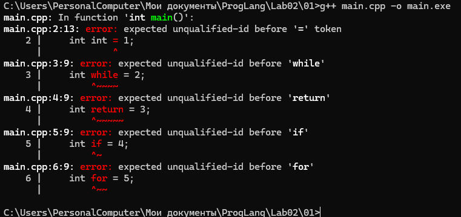
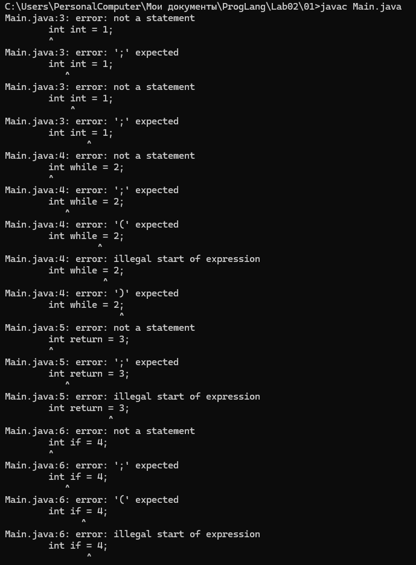
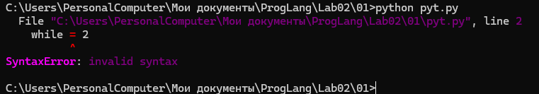
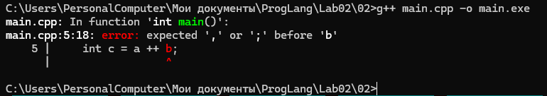
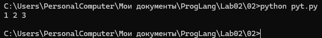
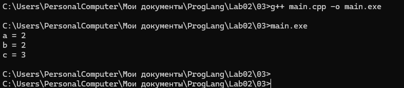
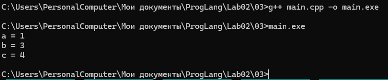

# Лабораторная работа 2

## Решение задач из практикума Python

## 01

```python
name1 = str(input())
name2 = str(input())
print(name1 + " and " + name2 + " was here")
```

## 02

```python
a, b, c = str(input()).split()
d, e = str(input()).split()
print(a, d, b, e, c, sep=',')
```

## 03

```python
a, b = str(input()).split()
c, d = str(input()).split()
e, f = str(input()).split()
print(len(a) * int(b) + len(c) * int(d) + len(e) * int(f))
```

## 04

```python
a = str(input())
print('*' * (len(a) + 4))
print('* ' + a + ' *')
print('*' * (len(a) + 4))
```

## 05

```python
a, b, c = map(int, input().split())
d, e, f = map(int, input().split())
print(d * 3600 + e * 60 + f - a * 3600 - b * 60 - c)
```

## 06

```python
n = int(input())

if n == 1:
    print("pusk")
else:
    print(n - 1)
```

## 07

```python
a, b, c = map(int, input().split())

if a == 3 and b == 3 and c == 3:
    print("hole")
else:
    print(a + b + c)
```

## 08

```python
a, b, c = str(input()).split()

if len(a) > len(b) and len(a) > len(c):
    print(a)
elif len(b) > len(a) and len(b) > len(c):
    print(b)
else:
    print(c)
```

## 09

```python
a, b = map(int, input().split())

if a > b:
    print('>')
elif a < b:
    print('<')
else:
    print('=')
```

## 10

```python
a, b, c = map(int, input().split())

if a > b:
    a, b = b, a

if c < a:
    print(a - c)
elif c > b:
    print(c - b)
else:
    print(0)
```

## 11

```python
x = int(input())

while x != 1:
    if x % 2 != 0:
        print(x, end=' ')
        x = x * 3 + 1
    else:
        print(x, end=' ')
        x = x // 2

print(1)
```

## 12

```python
n = int(input())
k = 1

while n >= 2 * k:
    k = k * 2

print(k)
```

## 13

```python
name = input()
n = 1

while name != "Petr":
    n += 1
    name = input()

print(n)
```

## 14

```python
n, a = map(int, input().split())

while n > 0:
    if a % 2 != 0 and a % 3 != 0 and a % 5 != 0 and a % 7 != 0:
        print(a)
        n -= 1
        a += 1
    else:
        a += 1
```

## 15

```python
a, b = input().split()

digits = {
    '0': 0,
    '1': 1,
    '2': 2,
    '3': 3,
    '4': 4,
    '5': 5,
    '6': 6,
    '7': 7,
    '8': 8,
    '9': 9
}

number_a = 0

for digit in a:
    number_a = number_a * 10 + digits[digit]

number_b = 0

for digit in b:
    number_b = number_b * 10 + digits[digit]

while number_b != 0:
    number_a, number_b = number_b, number_a % number_b

print(number_a)
```

## Задания лабораторной работы

## 01

Были выбраны следующие ключевые слова:

- C++: `int`, `while`, `return`, `if`, `for`;
- Java: `int`, `while`, `return`, `if`, `for`;
- Python: `while`, `return`, `if`, `for` `class`.

В Python не было взято слово `int` Поскольку в Python `int = 1`

синтаксически допустима т.к. просто перезаписывается имя встроенной функции int().

Попытка использовать ключевые слова в качестве идентификаторов приводит к синтаксической ошибке, поскольку ключевые слова имеют заранее определённое значение в грамматике языка.

**Проверка C++:**



**Проверка Java:**



**Проверка Python:**



## 02

### C++

Последовательность токенов:

`int | a | = | 1 | , | b | = | 2 | ;`

`int | c | = | a | ++ | b | ;`

В C++ последовательность `++` распознаётся токенизатором как единый оператор инкремента. 
Поэтому после выражения `a++` непосредственно расположен идентификатор `b`, между ними отсутствует бинарный оператор. Программа синтаксически некорректна.



### Python

Последовательность токенов:

`a | = | 1`

`b | = | 2`

`c | = | a | + | + | b`

В Python оператора `++` нет. Два символа `+` распознаются отдельно: первый является бинарным сложением, второй — унарным плюсом.

Поэтому выражение эквивалентно:

`c = a + (+b)`

При `a = 1`, `b = 2` получаем `c = 3`.



## 03

### Разбиение на токены

Выражение

```cpp
a +++ b
```

разбивается на следующие токены:

```text
a | ++ | + | b
```

Последовательность `++` распознаётся как единый токен — оператор постфиксного инкремента. Поэтому выражение интерпретируется как:

```cpp
(a++) + b
```

При начальных значениях:

```text
a = 1
b = 2
```

для вычисления выражения используется исходное значение `a`, после чего `a` увеличивается на единицу:

```text
c = 1 + 2 = 3
a = 2
b = 2
```

**Результат выполнения:**



### Влияние пробелов

Если изменить выражение на:

```cpp
a + ++b
```

оно будет разбито иначе:

```text
a | + | ++ | b
```

В данном случае `++` применяется уже к переменной `b`.

Таким образом, расположение пробелов между символами операторов может изменить результат токенизации и, следовательно, смысл выражения.

**Результат после изменения расположения пробелов:**



