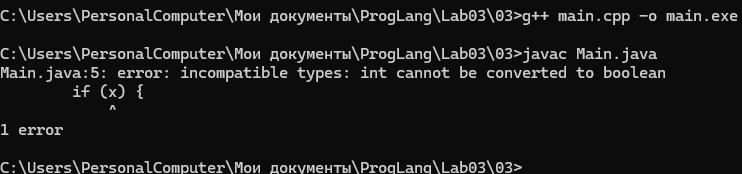
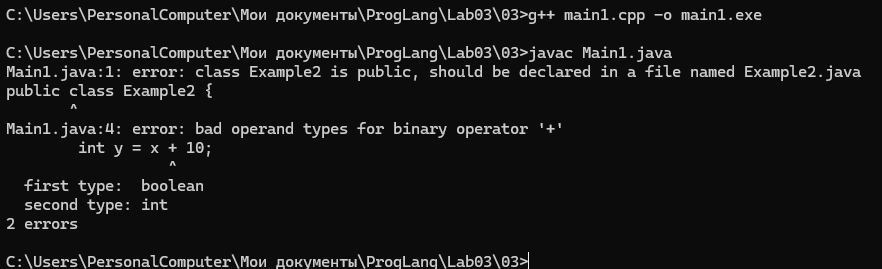
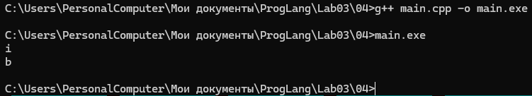
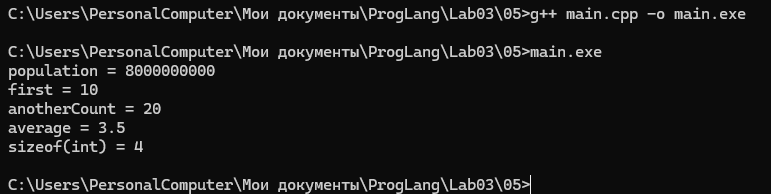
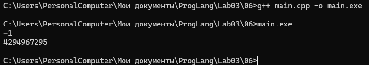
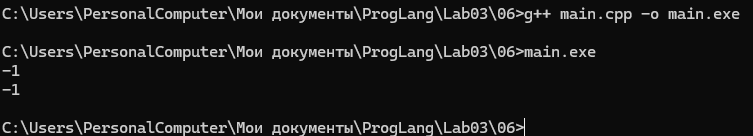
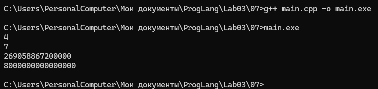
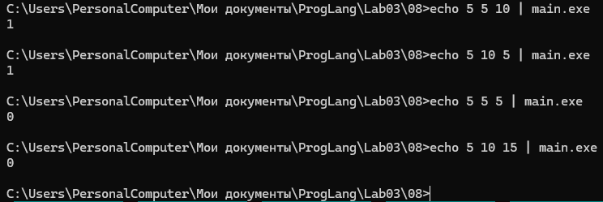
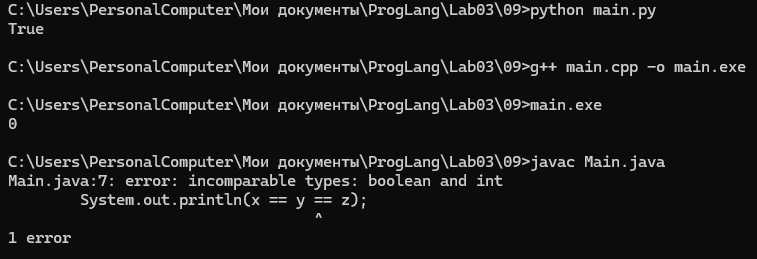
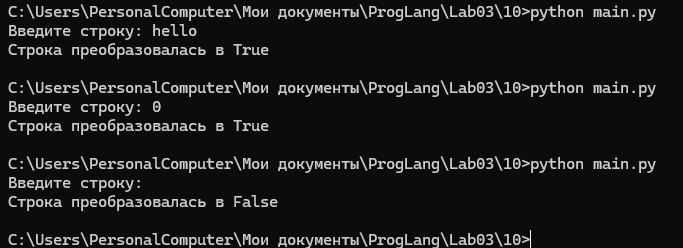

## Задание 1

**Тип в программировании** — атрибут объекта данных, задающий множество допустимых значений и методы для работы с ними.

**Статическая типизация** — тип объекта данных определяется в момент трансляции программы. Тип литералов определяется по их записи, переменных и именованных констант — по объявлению, результатов выражений — по оператору и типам операндов.

**Динамическая типизация** — тип объекта данных определяется на этапе выполнения программы в момент создания или присваивания значения.

**Неявная типизация** — тип определяется автоматически по тексту программы без явного указания типа программистом.

**Явное преобразование типа** — преобразование, которое явно указано в программе в виде вызова функции или операции.

**Неявное преобразование типа** — преобразование, которое явно не указано в программе, но транслятор самостоятельно применяет требуемый метод преобразования.

**Сильная типизация** — язык программирования не содержит или почти не содержит правил неявного преобразования типов.

**Слабая типизация** — язык программирования содержит большое число правил неявного преобразования типов и допускает каламбуры типизации.

## Задание 2

#### Преобразования при присваивании

При присваивании значение правого операнда приводится к типу левого операнда.

Например:

```cpp
int a = 3.9;
```

Значение `3.9` преобразуется в `int`. Дробная часть отбрасывается, поэтому `a` получает значение `3`.

#### Преобразования при арифметических действиях

Используются следующие правила:

1. Если длины обоих типов меньше `int`, значения преобразуются к `int`.
2. Если типы имеют разную длину, значение меньшего типа преобразуется к большему.
3. Если типы имеют одинаковую длину, но один знаковый, а другой беззнаковый, знаковое значение приводится к беззнаковому.
4. Если один операнд целый, а другой вещественный, целое значение приводится к вещественному.

Например:

```cpp
int a = 5;
double b = 2.5;
auto c = a + b;
```

При вычислении `a + b` значение `a` преобразуется в `double`, поэтому результат равен `7.5`.

#### Преобразования с логическими значениями

При преобразовании в `bool` значение `0` преобразуется в `false`, а остальные значения - в `true`.

При преобразовании из `bool` значение `false` преобразуется в `0`, а `true` — в `1`.

Результаты выражений в условиях ветвлений и циклов также приводятся к логическому типу.

## Задание 3

C++ и Java имеют похожий синтаксис, но различаются количеством разрешённых неявных преобразований типов.

#### Пример 1. Преобразование `int` в `bool`

C++:

```cpp
#include <iostream>

int main() {
    int x = 10;

    if (x) {
        std::cout << "true" << std::endl;
    }

    return 0;
}
```

C++ неявно преобразует ненулевое значение `10` в `true`, поэтому программа успешно компилируется.

Java:

```java
public class Example1 {
    public static void main(String[] args) {
        int x = 10;

        if (x) {
            System.out.println("true");
        }
    }
}
```

Java не выполняет такое неявное преобразование. Условие `if` должно иметь тип `boolean`, поэтому возникает ошибка согласования типов.




#### Пример 2. Преобразование `bool` в `int`

C++:

```cpp
bool x = true;
int y = x + 10;
```

В C++ `true` неявно преобразуется в `1`, поэтому результат равен:

```text
11
```

В Java аналогичное выражение с `boolean` и `int` вызывает ошибку согласования типов.

Таким образом, C++ допускает больше неявных преобразований между базовыми типами, чем Java.



---

## Задание 4

Рассмотрен код:

```cpp
bool x = true, y = false;

auto a = x & y;
std::cout << typeid(a).name() << std::endl;

auto b = x && y;
std::cout << typeid(b).name() << std::endl;
```

Оператор `&` является побитовым. Перед выполнением операции значения `bool` проходят целочисленное продвижение к `int`. Поэтому результат `x & y` имеет тип `int`, и переменная `a` также имеет тип `int`.

Оператор `&&` является логическим. Результат логической операции имеет тип `bool`, поэтому переменная `b` имеет тип `bool`.

В GCC `typeid().name()` может вывести:

```text
i
b
```

где `i` соответствует `int`, а `b` — `bool`.



---

## Задание 5

Пример разумного использования `typedef`, `auto`, `decltype`, `static_cast` и `sizeof`:

```cpp
#include <iostream>
#include <vector>

int main() {
    typedef unsigned long long ull;
    ull population = 8000000000ULL;

    std::vector<int> numbers = {10, 20, 30};
    auto it = numbers.begin();

    int count = 10;
    decltype(count) anotherCount = 20;

    int sum = 7;
    int amount = 2;
    double average = static_cast<double>(sum) / amount;

    std::cout << "population = " << population << std::endl;
    std::cout << "first = " << *it << std::endl;
    std::cout << "anotherCount = " << anotherCount << std::endl;
    std::cout << "average = " << average << std::endl;
    std::cout << "sizeof(int) = " << sizeof(int) << std::endl;

    return 0;
}
```

`typedef` используется для создания короткого имени `ull` для типа `unsigned long long`.

`auto` позволяет автоматически определить тип итератора `numbers.begin()`.

`decltype` позволяет получить тип существующего выражения или переменной.

`static_cast<double>` явно преобразует `sum` в `double`, благодаря чему выполняется вещественное деление и получается `3.5`, а не `3`.

`sizeof` позволяет узнать размер типа в байтах.



---

## Задание 6

Исходный фрагмент:

```cpp
int a = -1, b = 1;
unsigned int c = 1;

std::cout << a * b << std::endl;
std::cout << a * c << std::endl;
```

В выражении:

```cpp
a * b
```

оба операнда имеют тип `int`, поэтому результат равен `-1`.

В выражении:

```cpp
a * c
```

в операции участвуют `int` и `unsigned int`. При одинаковой длине знаковый операнд преобразуется в беззнаковый. Поэтому `-1` преобразуется в большое значение `unsigned int`.

При обычном 32-битном `unsigned int` результат равен:

```text
4294967295
```



Если заменить типы на:

```cpp
short a = -1, b = 1;
unsigned short c = 1;
```

перед арифметической операцией значения проходят целочисленное продвижение. В обычном окружении `short` и `unsigned short` преобразуются в `int`.

Поэтому оба выражения дают:

```text
-1
-1
```



---

## Задание 7

Рассмотрены выражения:

```cpp
int x = 7, y = 4;
long double d = 0.25;

cout << (x / y) / d << endl;
cout << (x / d) / y << endl;
```

В первом выражении сначала выполняется:

```text
7 / 4 = 1
```

Так как оба операнда имеют тип `int`, выполняется целочисленное деление.

После этого:

```text
1 / 0.25 = 4
```

Во втором выражении сначала выполняется `x / d`. Так как один операнд имеет тип `int`, а другой `long double`, целое значение преобразуется в `long double`:

```text
7 / 0.25 = 28
28 / 4 = 7
```

Таким образом, результаты отличаются:

```text
4
7
```

Также рассмотрены выражения:

```cpp
long a = 200000, b = 200000;
long long c = 200000;

std::cout << (a * b) * c << std::endl;
std::cout << a * (b * c) << std::endl;
```

В `(a * b) * c` сначала вычисляется произведение двух значений типа `long`. Если используемый `long` является 32-битным, математическое значение `40000000000` в него не помещается. 
Возникает переполнение знакового целого типа, для которого стандарт C++ не гарантирует конкретный результат.

В `a * (b * c)` сначала вычисляется `b * c`. Так как `c` имеет тип `long long`, значение `b` преобразуется в `long long`. Промежуточный результат вычисляется в более широком типе.

Результат:

```text
200000 * 200000 * 200000 = 8000000000000000
```

Таким образом, изменение порядка вычисления изменяет тип промежуточного результата и может влиять на результат программы.



---

## Задание 8

Рассмотрено выражение:

```cpp
(x == y) + (x == z) == true
```

Операции `x == y` и `x == z` возвращают значения типа `bool`.

При арифметическом сложении:

```text
false → 0
true → 1
```

Правая часть `true` при сравнении с целым значением также соответствует `1`.

Следовательно, всё выражение истинно только тогда, когда ровно одно из двух сравнений истинно.

Существуют два случая:

```text
1. x == y и x != z
2. x == z и x != y
```

Если все три значения равны:

```text
true + true = 2
2 == 1 → false
```

Если `x` не равен ни `y`, ни `z`:

```text
false + false = 0
0 == 1 → false
```

Таким образом, выражение истинно только тогда, когда `x` равен ровно одной из переменных `y` или `z`.



---

## Задание 9

Проверено выражение:

```text
x == y == z
```

в Python, Java и C++.

Для примера использованы:

```text
x = 2
y = 2
z = 2
```

#### Python

```python
x = 2
y = 2
z = 2

print(x == y == z)
```

Python поддерживает цепочечные сравнения. Выражение соответствует проверке:

```python
x == y and y == z
```

Поэтому результат:

```text
True
```



#### Java

```java
public class Main {
    public static void main(String[] args) {
        int x = 2;
        int y = 2;
        int z = 2;

        System.out.println(x == y == z);
    }
}
```

Сначала `x == y` даёт значение типа `boolean`. После этого получается попытка сравнить `boolean` с целочисленной переменной `z`.

Java не допускает такое сравнение, поэтому программа не компилируется.


#### C++

```cpp
#include <iostream>

int main() {
    int x = 2;
    int y = 2;
    int z = 2;

    std::cout << (x == y == z) << std::endl;

    return 0;
}
```

В C++ выражение вычисляется как:

```text
(x == y) == z
```

Сначала:

```text
2 == 2 → true
```

При следующем сравнении `true` неявно преобразуется в целое значение `1`:

```text
1 == 2 → false
```

Поэтому программа выводит:

```text
0
```


Таким образом, одинаково записанное выражение имеет различное поведение:

- Python использует цепочечное сравнение;
- Java выдаёт ошибку согласования типов;
- C++ выполняет последовательные сравнения с неявным преобразованием `bool` в целое значение.

---

## Задание 10

Программа:

```python
text = input("Введите строку: ")

if text:
    print("Строка преобразовалась в True")
else:
    print("Строка преобразовалась в False")
```

В условии `if` строка неявно рассматривается как логическое значение.

Пустая строка:

```text
""
```

преобразуется в `False`.

Непустая строка:

```text
"Hello"
```

преобразуется в `True`.

Даже строка:

```text
"0"
```

преобразуется в `True`, поскольку она не является пустой.

Таким образом, Python позволяет использовать строковые объекты непосредственно в логическом контексте без явного вызова `bool()`.

