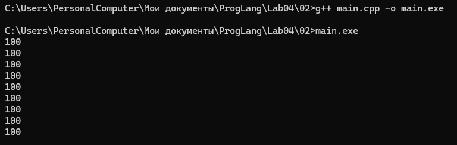
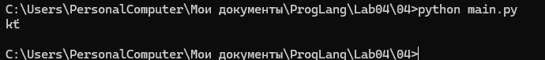
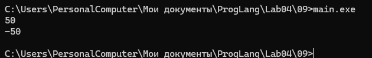

# Языки программирования
## Лабораторная работа 4

### Задание 1 **(3)**

#### Двоичное представление числа -99

Для получения дополнительного кода отрицательного числа инвертируем биты положительного числа и прибавляем 1.

```text
99 = 01100011
~99 = 10011100
~99 + 1 = 10011101
```

Поэтому:

```text
1 байт:
10011101

2 байта:
11111111 10011101

4 байта:
11111111 11111111 11111111 10011101
```

#### Наибольшее и наименьшее значение int

Для 32-битного `int`:

```text
max int = 2147483647 = 0x7FFFFFFF
min int = -2147483648 = 0x80000000
```

#### Двоичное представление символа `#`

Код символа `#` в ASCII равен 35.

```text
35 = 00100011
```

Следовательно:

```text
'#' = 00100011
```

---

### Задание 2 **(3)**

Пример программы с различными способами записи целочисленных литералов:

```cpp
#include <iostream>

int main() {
    int decimal = 100;
    int octal = 0144;
    int binary = 0b1100100;
    int hexadecimal = 0x64;

    unsigned int u = 100U;
    long int l = 100L;
    unsigned long int ul = 100UL;
    long long int ll = 100LL;
    unsigned long long int ull = 100ULL;

    std::cout << decimal << std::endl;
    std::cout << octal << std::endl;
    std::cout << binary << std::endl;
    std::cout << hexadecimal << std::endl;
    std::cout << u << std::endl;
    std::cout << l << std::endl;
    std::cout << ul << std::endl;
    std::cout << ll << std::endl;
    std::cout << ull << std::endl;

    return 0;
}
```

Префиксы определяют систему счисления:

```text
без префикса — десятичная;
0 — восьмеричная;
0b — двоичная;
0x — шестнадцатеричная.
```

Суффиксы определяют тип литерала:

```text
U — unsigned;
L — long;
LL — long long.
```



---

### Задание 3 **(2)**

Дан фрагмент:

```cpp
char a = 'a';
a = a + 10;
std::cout << a;
a = a + 250;
std::cout << a;
```

Код символа `'a'` равен 97.

После первой операции:

```text
97 + 10 = 107
```

Код 107 соответствует символу `'k'`.

После второй операции:

```text
107 + 250 = 357
```

Тип `char` занимает один байт, поэтому значение рассматривается по модулю 256:

```text
357 mod 256 = 101
```

Код 101 соответствует символу `'e'`.

Результат:

```text
ke
```

---

### Задание 4 **(2)**

Аналогичная программа на Python:

```python
a = 'a'

a = chr(ord(a) + 10)
print(a, end='')

a = chr(ord(a) + 250)
print(a)
```

Сначала:

```text
ord('a') = 97
97 + 10 = 107
chr(107) = 'k'
```

Затем:

```text
ord('k') = 107
107 + 250 = 357
chr(357) = 't'
```

Результат:

```text
kt
```

Результат отличается от C++, потому что Python использует Unicode и `chr(357)` непосредственно возвращает символ с кодом 357.
 В C++ значение сохраняется в однобайтовом `char`, поэтому происходит приведение к диапазону одного байта.



---

### Задание 5 **(2)**

```cpp
unsigned short x = 40000;
unsigned short y = x + x;
unsigned short z = x * 2;

y = y - x;
z = z / 2;

std::cout << y << " " << z << std::endl;
```

Для 16-битного `unsigned short` диапазон равен:

```text
0 ... 65535
```

Вычисляем:

```text
x + x = 40000 + 40000 = 80000
80000 mod 65536 = 14464
```

Поэтому:

```text
y = 14464
z = 14464
```

Далее:

```text
y - x = 14464 - 40000 = -25536
-25536 mod 65536 = 40000
```

Следовательно:

```text
y = 40000
```

Для `z`:

```text
z / 2 = 14464 / 2 = 7232
```

Итог:

```text
40000 7232
```

При сложении с последующим вычитанием исходное значение восстанавливается в арифметике по модулю `2^16`.
 При умножении сначала происходит переполнение и теряется часть значения, поэтому последующее деление на 2 уже не восстанавливает исходное число.

---

### Задание 6 **(2)**

Для 32-битного типа:

```text
2^32 = 4294967296
```

#### 1

```text
2000000000 + 1000000000 = 3000000000
3000000000 - 4294967296 = -1294967296
```

Результат в используемой модели переполнения:

```text
-1294967296
```

#### 2

```text
2000000000U + 1000000000U
= 3000000000
```

Результат:

```text
3000000000
```

#### 3

```text
2500000000U + 2500000000U
= 5000000000

5000000000 mod 4294967296
= 705032704
```

Результат:

```text
705032704
```

#### 4

```text
2500000000LL + 2500000000LL
= 5000000000
```

Тип `long long` позволяет сохранить полученное значение.

Результат:

```text
5000000000
```

#### 5

```text
20000U * 200000U
= 4000000000
```

Значение помещается в `unsigned int`.

Результат:

```text
4000000000
```

#### 6

```text
200000U * 200000U
= 40000000000

40000000000 mod 4294967296
= 1345294336
```

Результат:

```text
1345294336
```

---

### Задание 7 **(2)**

Число 1000 можно представить как сумму степеней двойки:

```text
1000 = 512 + 256 + 128 + 64 + 32 + 8
1000 = 2^9 + 2^8 + 2^7 + 2^6 + 2^5 + 2^3
```

Сдвиг `x << n` соответствует умножению на `2^n`.

Программа:

```python
x = int(input())

y = (x << 9) + (x << 8) + (x << 7) + (x << 6) + (x << 5) + (x << 3)

print(y)
```

Таким образом, используется только сложение и операции сдвига.

---

### Задание 8 **(2)**

#### 1. `(1000 & 100) << 10`

```text
1000 = 1111101000
100  = 0001100100

1111101000
0001100100
----------
0001100000
```

Получаем:

```text
1000 & 100 = 96
96 << 10 = 96 * 1024 = 98304
```

Ответ:

```text
98304
```

#### 2. `(1000 >> 4) & 15`

```text
1000 >> 4 = 62

62 = 111110
15 = 001111

111110
001111
------
001110
```

Ответ:

```text
14
```

#### 3. `~1234 + 1234`

Для дополнительного кода:

```text
~x = -x - 1
```

Поэтому:

```text
~1234 = -1235
-1235 + 1234 = -1
```

Ответ:

```text
-1
```

#### 4. `(1000 ^ 500) & 63`

```text
1000 = 1111101000
500  = 0111110100

1111101000
0111110100
----------
1000011100
```

Теперь:

```text
1000011100
0000111111
----------
0000011100
```

```text
11100(2) = 28
```

Ответ:

```text
28
```

#### 5. `(100 << 3) + (100 >> 3)`

```text
100 << 3 = 800
100 >> 3 = 12

800 + 12 = 812
```

Ответ:

```text
812
```

---

### Задание 9 **(2)**

В дополнительном коде выполняется:

```text
-x = ~x + 1
```

Поэтому программу можно записать следующим образом:

```cpp
#include <iostream>

int main() {
    int x;
    std::cin >> x;

    int y = ~x + 1;

    std::cout << y << std::endl;

    return 0;
}
```

Операция `~x` инвертирует все биты числа, а прибавление единицы формирует дополнительный код противоположного по знаку числа.

